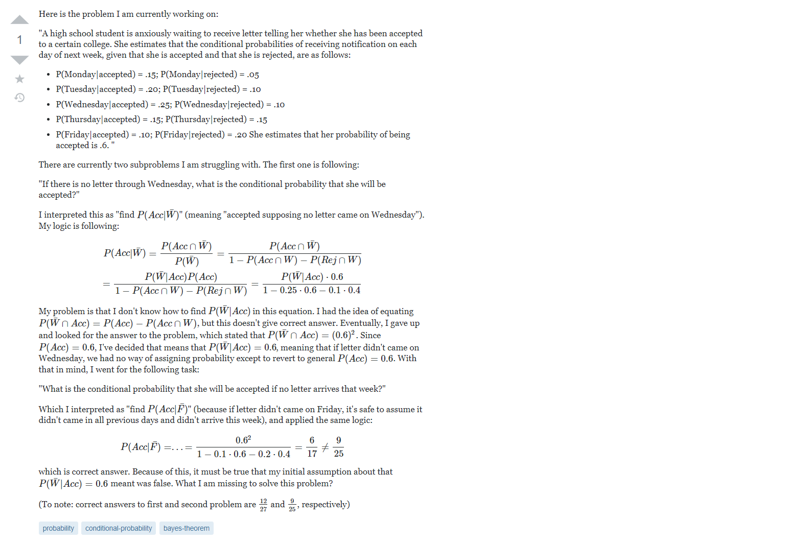
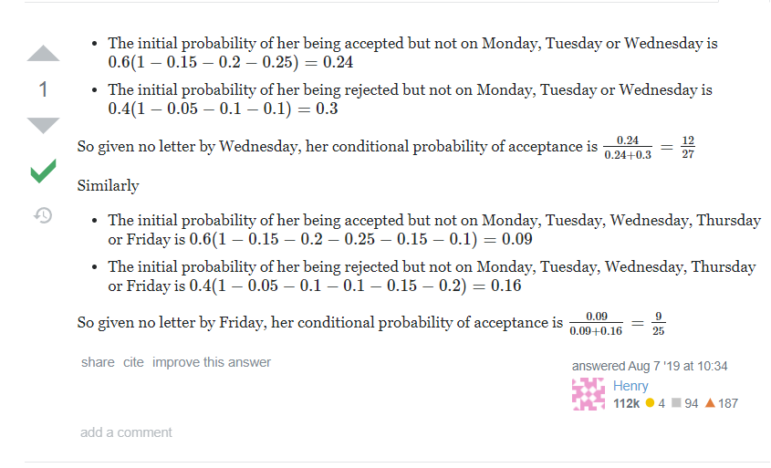
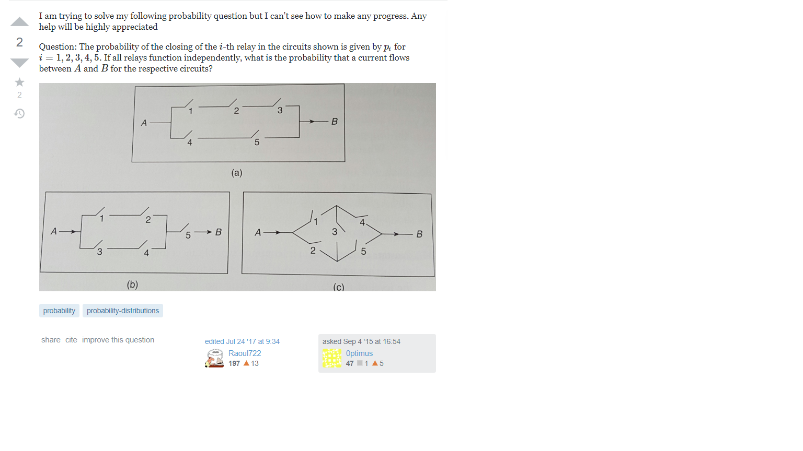

## The Internet

There are a vast array of resources and forums available online for an unimaginable number of topics. With the web being world-wide
and easily accessible, there are also many people, with different personalities and knowledge, browsing the internet and participating 
in the many online communities. 

With the internet being a place to learn, it is inevitable that communities in which people can share and divulge information have formed.
Questions and answers are posted by people with varying knowledge and experience; because of this, the quality of questions and answers
can also range widely in their quality and content.

## Smart Questions
As explained by Eric Raymond in the essay [found here](http://www.catb.org/esr/faqs/smart-questions.html), smart questions are polite,
contain relevant background information, and aren't too broad. These questions show that the question-asker has put effort into their
question and is willing to learn. 

One example of a good question can be found on the Math forums on StackExchange. Here is a screenshot of the question:

We see that the user provides an explanation of the problem, their current progress, and a specific, nicely worded question.
The question also contains formatted equations and is split into readable paragraphs. 

Good questions usually produce good result. This question was posted at 10:20 on August 7, 2019. fourteen minutes later, at 10:34 on August 7, 2019,
the user received a nice, informative response to their question. The response is shown below:

## Bad Questions
As there are smart questions, there are also poor questions. These questions contain little information and show little effort on the 
question-asker's side. Pulling again from the Math StackExchange, we see this question:

While the question does have some good points (the question is specific andcontains background information), it is not apparent if the
user has put any effort into solving the question before posting on the forum. Like the previous example, this question is obviously
a homework question--this can naturally be a deterrent to people wanting to answer the question. Unlike the previous example, in which
the user has has already solved the majority of the problem and just needs help finding where he went wrong, this user is asking
for a solution to the entire problem.

This is discouraged as (1) the question-asker should be solving homework by themself and (2) the question-answerer is required to put
more effort into solving the problem and potential answerers may be discouraged from providing an answer. As noted by Raymond, question
askers should exhaust all other options and gather as much information as they can before asking for help.

