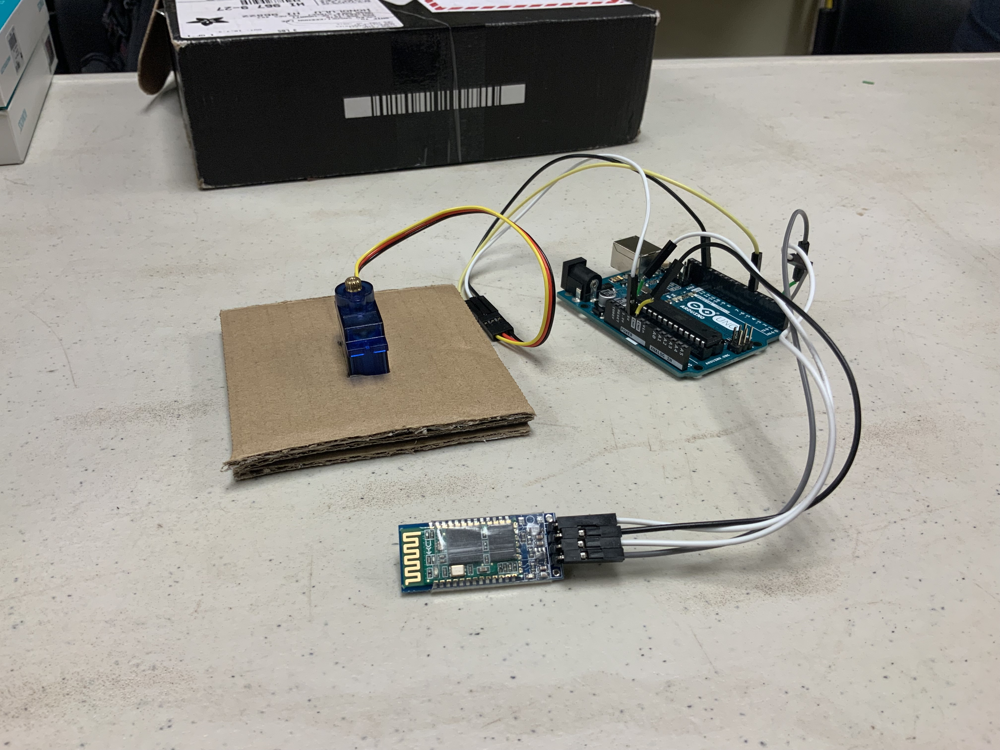
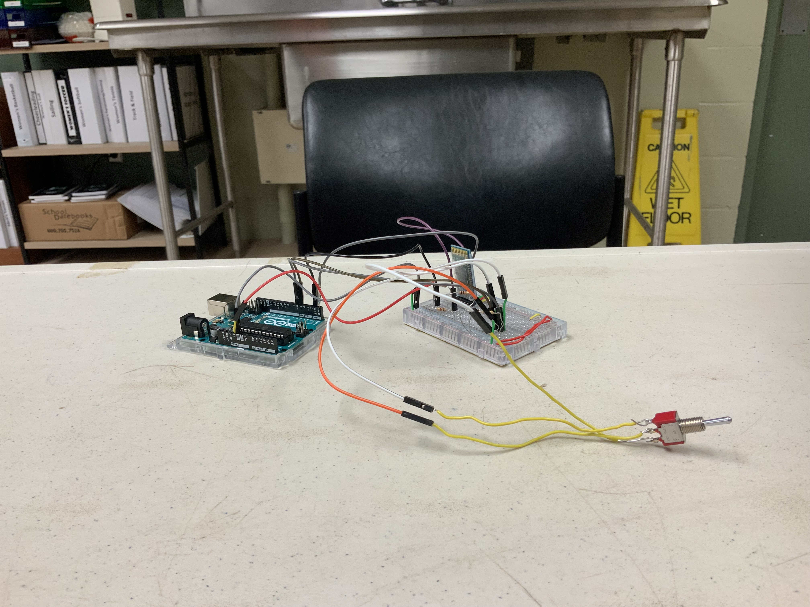

  
  
  
  

The Motorcycle Visibility HUD was a project done in my sophomore year; it was my first real project working with either software or hardware. The project was built with Arduino UNOs, HC-06/05 Bluetooth Chips, a SPI OLED display, mini toggle switch, resistors, and lots and lots of wires. 

