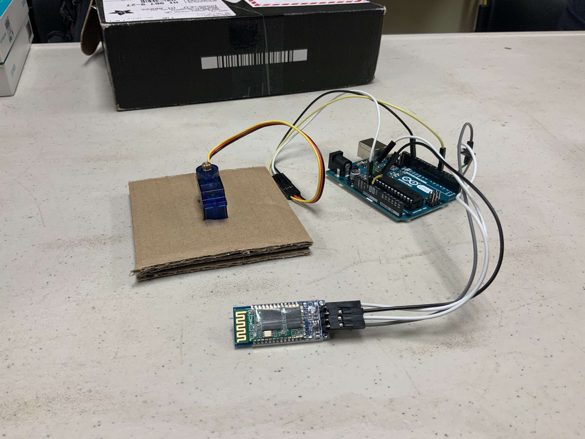

  
  
  
  

The Motorcycle Visibility HUD was a project done in my sophomore year; it was my first real project working with either software or hardware. The project was built with Arduino UNOs, HC-06/05 Bluetooth Chips, a SPI OLED display, mini toggle switch, resistors, and lots and lots of wires. 

The final iteration of our design consisted of a camera mounted on a servo and a screen attached to a motorcycle helmet. The camera would be attached to the rear of the motorcycle and would be able to rotate to the right, back, or left depending on the user's input. The camera would be connected to the switch and screen via a bluetooth connection. 

Our screen sat on the inside of the helmet and was orientated towards the top of the helmet. Above the screen was a lens and a piece of acrylic. Video on the screen would pass through the lense and reflect off the acrylic, allowing the user to see through our rear-facing camera. 
