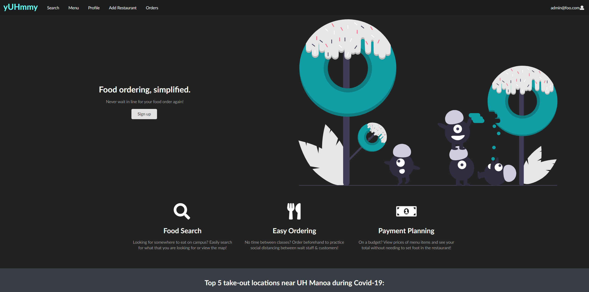
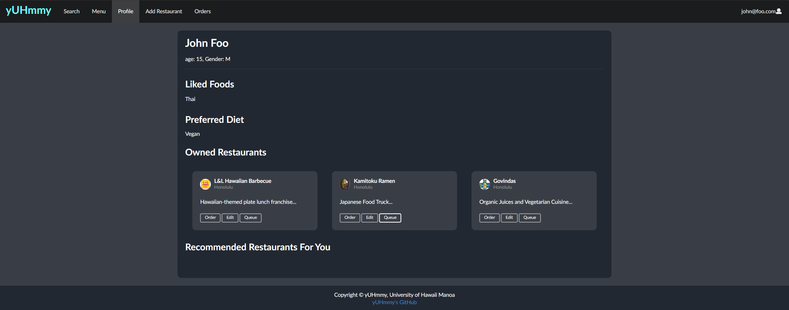
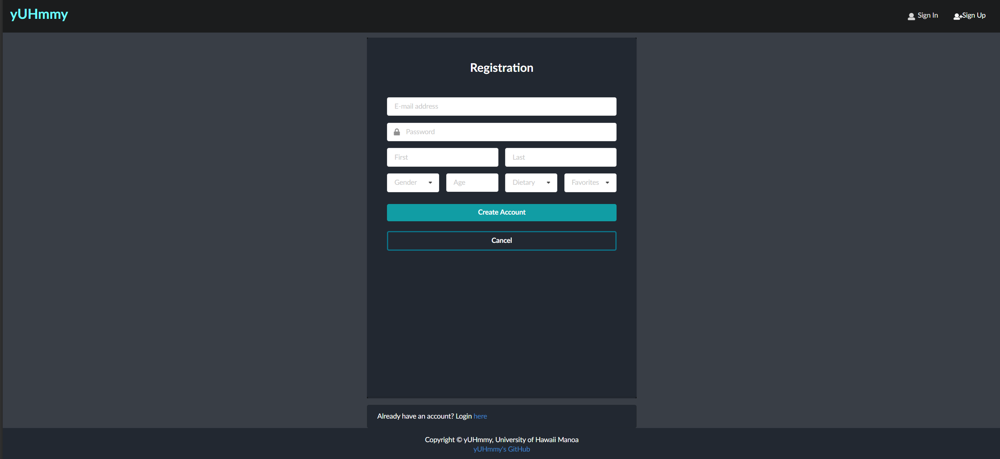

## Overview

 

yUHmmy is an app designed to improve the dine-in experience for both restaurant owners and customers. On the customer's end, we provide an interface to order food without having to interact with waitstaff. Additionally, the app provides restaurant recommendations based on user-entered preferences and dietary restrictions. 

On the restaurants end, we provide a way to create/edit menus and an interface to show pending orders. The app is helpful in freeing up restaurant waitstaff and also keeps track of orders for each table. 

The project was built using Meteor, React, and Semantic-UI frameworks. MongoDB was used to store data on the backend side. 

## My Work

My contributions to the project included setting-up the backend and integrating front-end portions with our Mongo database. I also created/styled a couple of the pages, including the profile page:

and the registration page:

Working with Mongo was definitely a struggle. Personally, I have experience in SQL, thus, I tried to create a relational structure for our project. Mongo is not built for this, so I struggled. In addition to Mongo, we used `simple-schema` which defines a structure and data constraints for collections within Mongo collections. 

Overall, in my personal opinion, I saw Mongo as lacking compared to SQL (specifically comparing Microsoft's T-SQL). Pulling data from the database involves a lot of work in filtering. Additionally, not everything works as intended. For example, the `$where` clause, used in `find()` is intended to provide a way to filter using functions. However, when used in JS, it always returns 1 and thus, does not actually filter anything.

Overall, working on this project was a good experience, I learned a lot about web development and working collaboratively on software projects. There was a lot of time spent researching the various frameworks that were used in this project. Keeping code standardized was a pain; however, it is useful when working with others. Having a standard format makes it easier to read others (and my own) code. It makes it easier for site maintenance and when adding further functionality to existing components/pages.